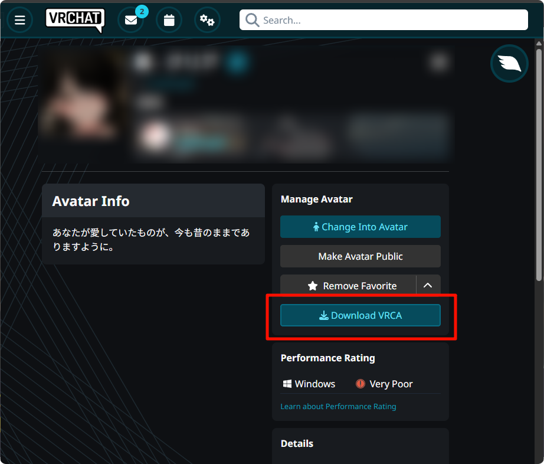

> # THERE IS TO BE NO MALICIOUS USE OF THIS TOOL!  
> **This tool is designed to recover your lost assets.**  
**Please don't ask, or redesign this tool, to rip assets that aren't your own!**

# VRChatVRCADownloader-Chrome
A Google Chrome extension that adds a Download VRCA button to Avatar pages on the official VRChat website.

# Usage Tutorial
1. Download `vrca-downloader-chrome.zip` from the release page
2. Extract it to any local folder
3. Open Chrome browser → visit `chrome://extensions/`
4. Enable **Developer mode** in the top-right corner
5. Click **Load unpacked**
6. Select the extracted folder
7. Installation complete → Visit any Avatar page on the official VRChat website to see the **Download VRCA** button

**If the button doesn't appear after installation, try refreshing the page.**

